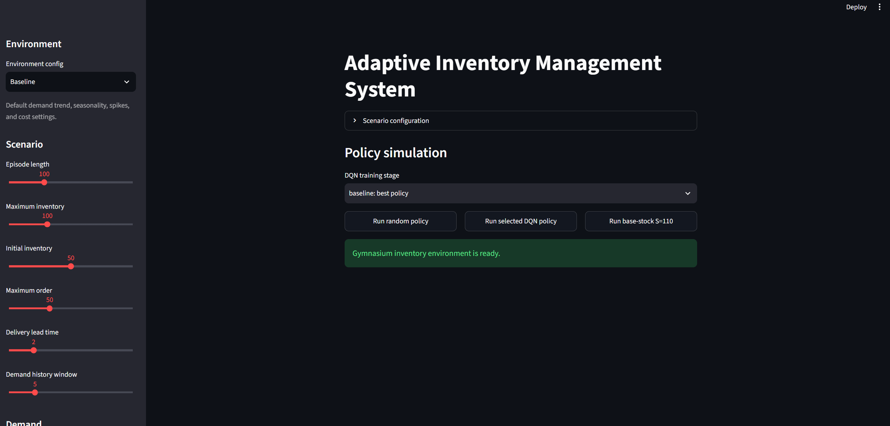
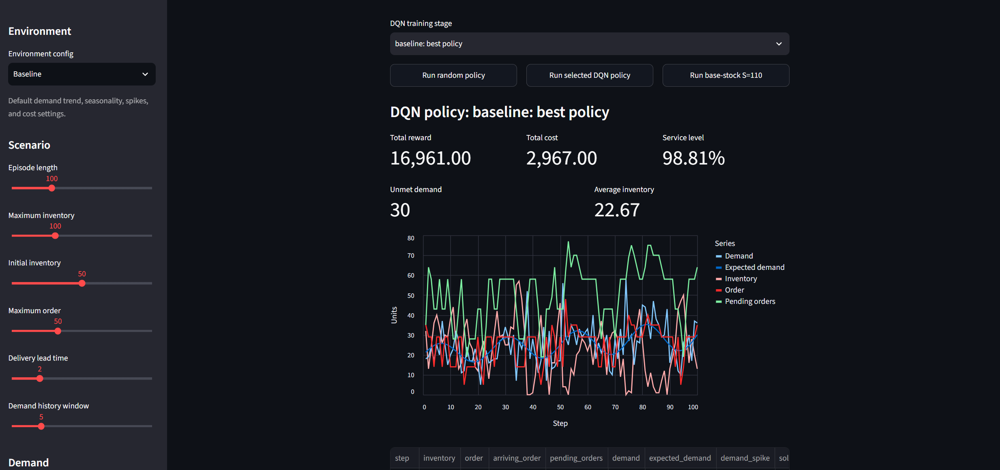
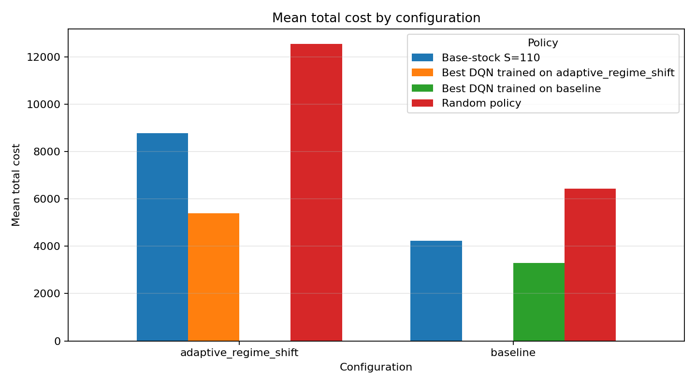

# Adaptive Inventory Management with Reinforcement Learning

Inventory control with reinforcement learning. A DQN agent learns when and how much to order under seasonal demand, demand spikes, and delivery delays. A Streamlit app compares its decisions with random ordering and a base-stock policy.

Built with [Gymnasium](https://github.com/Farama-Foundation/Gymnasium), [Stable-Baselines3](https://github.com/DLR-RM/stable-baselines3), and [Streamlit](https://github.com/streamlit/streamlit).



*Start page with the baseline scenario selected.*

## Installation

Developed and tested with Python 3.12. Run these commands from the repository directory:

```bash
python -m venv .venv
```

Activate the environment:

```powershell
# Windows PowerShell
.\.venv\Scripts\Activate.ps1
```

If PowerShell blocks the activation script, use `.\.venv\Scripts\python.exe` in place of `python` in the install and run commands below. Activation is optional when you call the environment's Python directly.

```bash
# macOS / Linux
source .venv/bin/activate
```

Then install the dependencies:

```bash
python -m pip install -r requirements.txt
```

## Usage

### Run the demo

```bash
python -m streamlit run app.py
```

Open the URL printed in the terminal. Select a scenario and model, adjust the parameters in the sidebar, and run a policy. Trained models for both scenarios are included in `models/training_runs/`.



*Example episode using the best saved DQN policy for the baseline scenario.*

Changing the settings runs the saved policy in the modified environment; it does not retrain the model. Separate demo runs can use different demand sequences. Use the evaluation scripts for comparisons with matching seeds.

### Train

```bash
# Train either scenario
python train_dqn.py baseline
python train_dqn.py adaptive_regime_shift

# Train both
python train_dqn.py baseline adaptive_regime_shift
```

Training settings are in [train_dqn.py](train_dqn.py): up to 1,000,000 steps, evaluation every 10,000 steps, and early stopping. Models and metrics are written to `models/training_runs/<scenario>/`. Re-running training overwrites files in that directory.

### Evaluate

```bash
# Compare the best saved models against random and base-stock policies
python compare_configurations.py

# Generate baseline training curves and an initial/best policy comparison
python generate_report_artifacts.py
```

Tables and plots are saved to `models/report_artifacts/`.

`python evaluate_dqn.py` also compares base-stock targets from 60 to 130 in the baseline scenario. It prefers the final model over the best checkpoint, so its results can differ from those below.

## Environment

The agent chooses an order quantity each period. Orders arrive after a fixed delay, available stock is sold, and remaining inventory incurs a holding cost. The observation includes inventory, recent demand, pending deliveries, episode progress, and seasonal features.

```text
reward = sales revenue - fixed ordering fee - holding cost - unmet-demand penalty
```

The DQN has two hidden layers of 128 neurons. Each scenario has its own model:

| Scenario | Demand | Episode | Lead time |
| --- | --- | ---: | ---: |
| `baseline` | Upward trend, seasonality, occasional spikes | 100 steps | 2 steps |
| `adaptive_regime_shift` | Mean demand changes from 12 to 32 to 18 at steps 0, 35, and 75; more spikes in the last phase | 120 steps | 3 steps |

See [config.py](config.py) for demand and cost parameters. The base-stock policy orders toward a target inventory position, counting both available stock and pending deliveries.

## Results

Means over 100 episodes per policy, using seeds 0-99 for each scenario. DQN results use the best saved model. Service level is the fraction of demand fulfilled in an episode, averaged over episodes.

| Scenario | Policy | Reward | Total cost | Service level |
| --- | --- | ---: | ---: | ---: |
| Baseline | DQN | 16,972.79 | 3,289.21 | 97.08% |
| Baseline | Base-stock S=110 | 16,214.07 | 4,227.61 | 97.93% |
| Baseline | Random | 12,280.68 | 6,447.00 | 89.77% |
| Regime shift | DQN | 15,664.63 | 5,394.65 | 96.68% |
| Regime shift | Base-stock S=110 | 10,317.89 | 8,791.79 | 87.74% |
| Regime shift | Random | 8,840.93 | 12,566.35 | 98.25% |



DQN reduced cost by 22% and 39% compared with S=110 in the baseline and regime-shift scenarios, respectively. It achieved the highest reward in both, though other policies fulfilled slightly more demand in some cases.

The baseline run stopped at 850,000 training steps; the regime-shift run reached 1,000,000. Full results: [CSV](models/report_artifacts/config_experiment_results.csv).

### Scope

- Demand is simulated. Orders have a fixed fee but no per-unit purchase cost. Excess arrivals are discarded, and unmet demand is lost rather than backlogged.
- These runs use one training seed per scenario and a fixed S=110 comparison policy. Seeds 0-9 are also used for training progress metrics. The results do not establish performance on unseen demand regimes or against a tuned base-stock policy.

## About

Developed as a team project for the Machine Learning Algorithms 2 course at Kaunas University of Technology.
